# XAI (Explainable AI)

## Blackbox Problem

Machine Learning, AI based 시스템은 일명 **"블랙박스"** 라고도 불림.

Why ?

무엇이 input 으로 주어지고, 무엇을 output 으로 주어지는지는 알지만 그 안에서 무엇이 어떻게 진행되는지, 그리고 왜 그런 결과가 나오는지 알지 못함

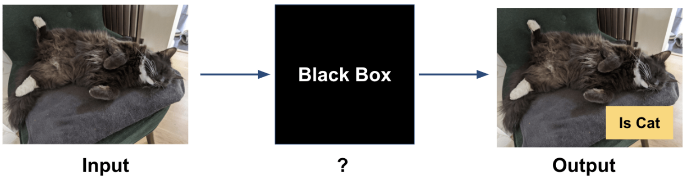

 
엥 ?

Objective Function 을 최소/최대화 하는 방향으로 weight (latent factor) 들을 변화시켜가면서 최적의 weight 를 찾아내니까 그런 결과가 나오는 것 아닌가?

- Weight 가 의미하는 바가 뭔데 ?ㅇ
- 고양이랑 비슷한게 뭔데 ?
  - 눈이 있음 ...?
  - 털이 있음 ...??
  - 귀가 있음 ...???
  - 귀여움 ......??????

## XAI

Blackbox Problem 은 Machine Learning, AI based 시스템이 목표로 하는 바가 주로 **"명확한 답이 존재하지 않는 문제에 대한 해답을 얻기 위해서"** 이기 때문에 나타남.

- 강아지랑 고양이 분류하기 (O)
- 사람처럼 생긴 이미지 생성하기 (O)
- 텍스트가 묘사하는 것에 대한 이미지 생성하기 (O)
- 특정 사용자가 좋아할만한 영화 메인에 띄워주기 (O)
- 자동차 별 최대 시속 구하기 (X)

 

### 목적 ?

1. **설명 가능한 모델**을 만들기 위해
2. Machine Learning, AI based 시스템에 대해 인간이 믿을 수 있도록 하기 위해
3. 법적/윤리적 기준 설립의 척도를 마련하기 위해

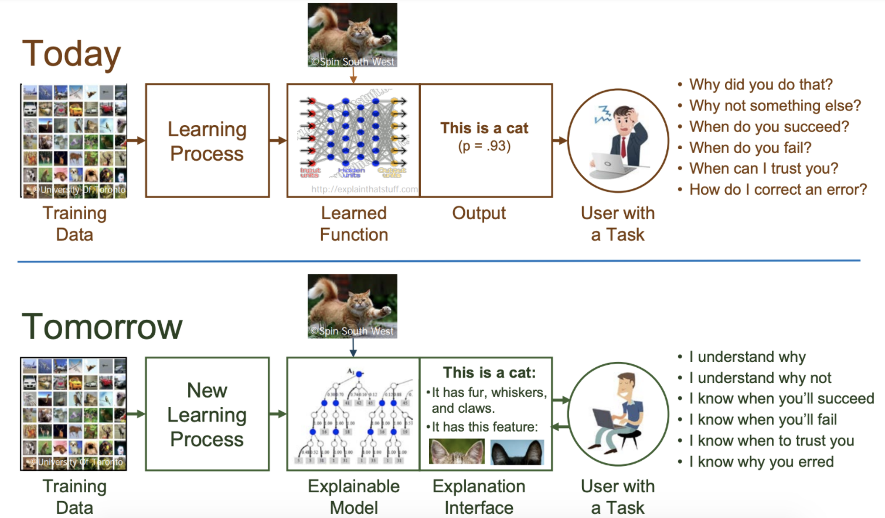

설명가능성이 뭔데 ?

**"모델이 어떤 역할을 하는지 정확하게 이해할 수 있다."**

- 모델이 다양한 상황에서 어떻게 결과를 내는지
  - 어떤 경우에 개/고양이 분류를 성공하는지
  - 어떤 경우에 개/고양이 분류를 실패하는지
- 이 input 을 넣었을 때의 결과를 믿을 수 있는지
- ex) 모델이 **눈, 털, 귀가 있는 걸 고양이로 분류**하고, 내가 지금 눈, 털, 귀를 가진 괴물을 넣었으니 이 결과는 믿을 수 없군...
  - 눈이 뭔데 ? 코가 뭔데 ? 귀가 뭔데 ? (스트레스...)
    - 완벽한 설명은 애초에 불가능
    - 뭔지 모르지만, 이전보다 나음
    - 적어도 설명할 수는 있다. More explainable AI...
- 부가효과: 좋은 모델의 설계가 가능

 

### 왜 꼭 필요해 ??

1. Optimization 을 하기 위해

   - 이해할 수 없는 것은 최적화할 수 없음
   - Objective Function 설계
   - ex) 눈, 코, 귀가 있는 것을 고양이라고 판단하네... 눈, 코, 귀가 있어도 형체에 돌기가 적어야 하는 조건을 추가해볼까 ?

2. 모델의 결과로 인한 판단에 도움을 주기 위해

   - 모델로 결과에 대한 예측은 가능하나, 결과에 대한 대책에 근거가 없음
   - ex) 소비자가 신제품을 구매하지 않을 확률이 95% 라 판단해서 가격을 기존보다 낮췄는데, 가격 때문에 신제품을 구매하지 않을 확률이 높은 것이 아니었을 경우

3. 데이터에 의존적인 시스템에서 벗어나기 위해

   - 준비한 데이터에 대한 전적인 믿음에 기반한 데이터에 의한 관계 추출
   - 편향된 데이터 수집
   - 악의적인 학습 데이터 조작/공격에 취약
   - 악의적인 input 데이터 조작/공격에 취약

   - 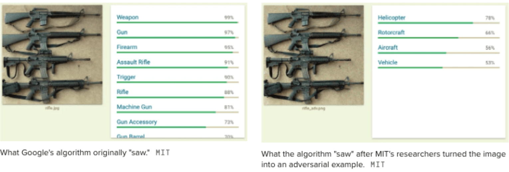
   - 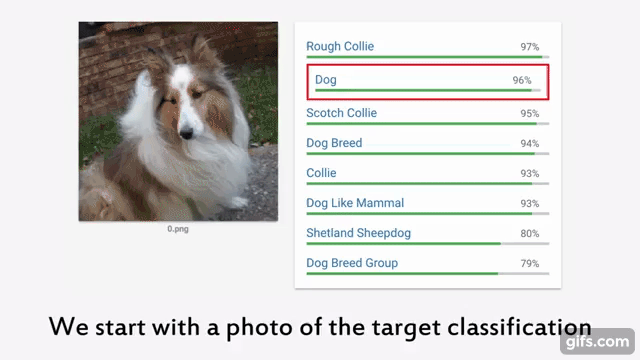

   - [Rick & Morty](https://youtu.be/fEBoXqe-Zrc?t=69)

4. Machine Learning, AI based 시스템이 법적, 규제적, 윤리적 고려들과 필연적으로 함꼐해야 하기 때문

   - input 이 output 으로 이어진 과정을 알아야 법적, 규제적, 윤리적 문제에 대한 판단 가능
   - Automated Decision
   - ex) 자율주행 자동차의 사고
   - 4번과 합쳐졌을 때, 악의적인 피해를 주는 것도 가능 (픽셀 조작, 시야 조작)

 

### 그래 좋아. 필요한 것 알겠어. 하지만 완벽히 설명은 못하잖아. 얼만큼 해야해 ??

모델의 복잡성(Complexity) 와 모델 설명가능성(Explainability) 는 **일반적으로 반비례**

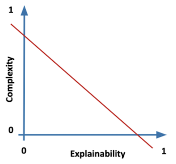

Complexity 는 뭔데 ??

- Dimensionality
- Linearity
- Monotocity

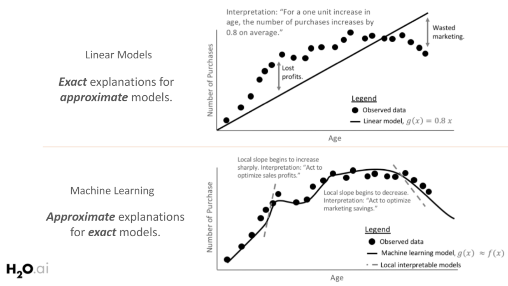

- 모델의 Complexity 는 위의 Machine Learning Model 이 더욱 높음
- 모델의 Explainability 는 Linear Model 이 더욱 높음
  - y = 0.8x 에서의 0.8
  - y = 2.3x4 + 1.7x3 0.7x2 6.8x + 1 에서의 2.3, 1.7, 0.7
  - 얼마나 더 잘 설명할 수 있는가

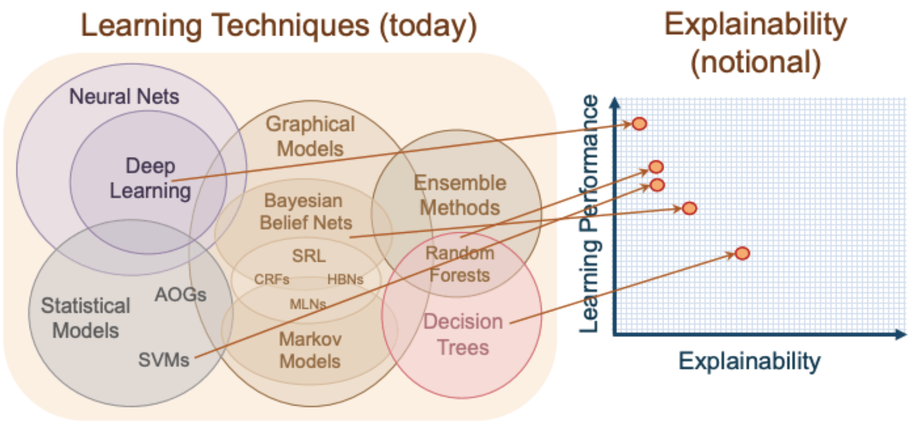

- Deep Learning
- Decision Tree
- Learning Technique 에 따라 **Explainability 를 바꿀 수 있음**

모델의 중요성(Criticality) 와 모델이 필요한 설명가능성은 **일반적으로 반비례**

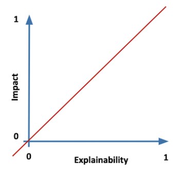

Criticality 는 뭔데 ??

- 모델이 다루고자 하는 문제의 중요성
- 중요성의 기준은 뭔데ㅔ에ㅔ에ㅔ !!

  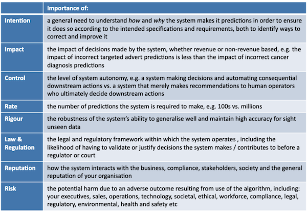

다시 본론으로, Explainability 를 얼만큼 해야해 ?

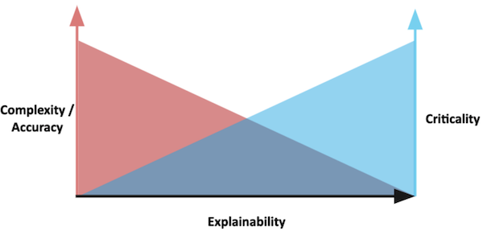

- **"Trade off between Complexity & Criticality"**
- 높은/민감한 중요도의 문제를 해결하는 모델에 대해서는 높은 설명가능성을 부여해야 하고, 그만큼 Complexity 를 낮게 가져가도 됨
- 낮은 중요도의 문제를 해결하는 모델에 대해서는 굳이 높은 설명가능성을 부여할 필요가 없고, 그만큼 Complexity 를 높게 가져가도 됨
- ex) 자율주행 시스템 VS 개/고양이 분류기

위의 Trade off 를 조절하는 예시들 ?

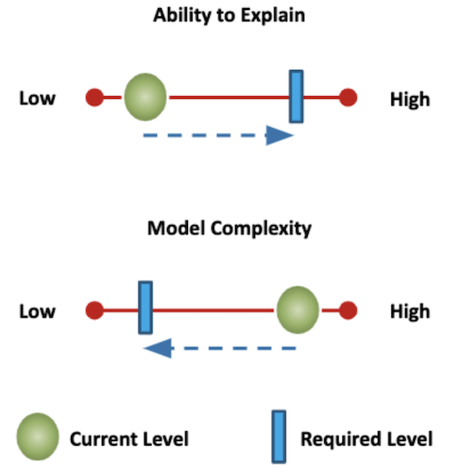

- Necessary Explainability 의 설정 (by Criticality 에 대한 기준표)
- Explainability < Necessary Explainability: 모델 커스터마이징
- Explainability > Necessary Explainability: Accuracy 를 위한 모델 Complexity 증가

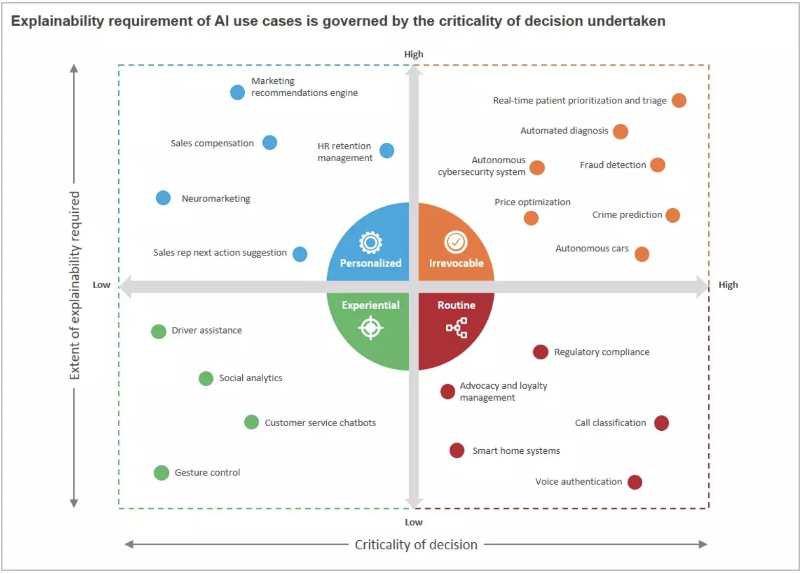

- Criticality 와 Necessary Explainability 에 따른 분류

### 그래. 어떻게 하는지도 알았어. 현 상황은 어떤데 ??

- 일부 AI Scientist (페이스북의 수석 과학자 Yann Lekun) 들은 Reliability = Trustability 라 주장
- 엄격한 테스트로 설명을 대신할 수 있다.
- 다른 AI Scientist (Microsoft Research 의 Rich Caruana) 들은 Reliability != Trustability 이며 Trustability 이상의 악의적인 공격에서도 안전을 보장받아야 한다고 주장
- GAN 의 예시로 Layer On/Off 등을 하면서 어떤 neural layer 가 어떤 이미지를 생성하는데 기여하는지에 대한 디버깅같은 작업을 하는 등의 실 적용도 이루어지고 있음

## XAI Examples

1. Amazon 의 CV screening

- 아마존에서 진행한 취업 지원서에 대한 자동 검사
- 남성 지원자가 많아서 상대적으로 합격자도 남성 지원자가 많았고, 합격자들의 공통점들 중에 남성으로서 가지는 공통점들이 많았음
- 아마존은 결과적으로 남성이라는 항목이 평가에 긍정적인 영향을 준다는 것을 자각하고 이를 폐지 (여성 취업 지원자의 합격 수가 점점 감소했었음)
- 흥미로운 점은, 지원서에서 성별을 지우고 구축한 시스템에서도 결과가 크게 다르지 않았음
- 결과적으로, 이러한 평가는 남성이라서가 아니라 남성들이 주로 보이는 특성인 자신감있고 권위적인 어투의 지원서 특성에 긍정적인 영향을 주는 것이었음
- 모델이 "지원서의 어투가 자신감있고 권위적인지에 대한 여부"를 하나의 주요 평가요소로 특성 삼아서 굴러가고 있다는 것을 "설명"할 수 있었다면 이런 일이 일어났을까???

2. 미국의 대출 부과 시스템

- 미국의 대출 금리 부과는 시스템으로 금리를 산정
- 일반적으로 라틴계 미국인, 아프리카계 미국인이 6~9 basis points 를 더 높게 금리를 부과받았다.
- 이는 라틴계, 아프리카계 미국인 대출자들의 역사적 데이터의 편중에 의한 결과로 밝혀졌으며, 피부색으로 금리를 결정하는 어처구니 없는 상황이었음
- 모델이 "미국인의 피부색"이 하나의 주요 평가요소로 특성 삼아서 굴러가고 있었다는 것을 "설명"할 수 있었다면 이런 일이 일어났을까?

3. 영국이 COVID-19 상황에서 세운 A-LEVEL TEST 에 대한 대안책

- A-LEVEL TEST 는 한국의 수능과도 같은 시험
- COVID-19 바이러스가 퍼지면서 국제적 단위의 대면 시험을 치르는 것에 무리가 있다고 판단한 영국은 자체 개발한 시스템으로 성적을 예측하기로 함
- 교사들의 평가점수 + 지난 시험성적을 비롯한 학생 정보를 기반으로 한 평가기관의 보정을 기반으로 시스템을 굴렸음
- 공립학교 학생들이 사립학교 학생들보다 실제보다 훨씬 저평가를 받는 상황이 나타남
- 결과적으로, 이러한 평가는 그들의 출신 학교에 대한 보정이 들어갔다는 것을 알게되고 많은 학생들이 반발함
- 모델이 "출신 학교"를 하나의 주요 평가요소로 특성 삼아서 굴러가고 있었다는 것을 "설명"할 수 있었다면 이런 일이 일어났을까?
